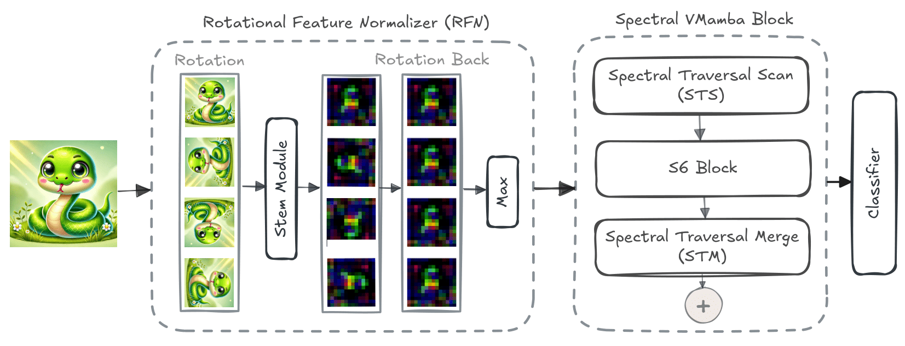
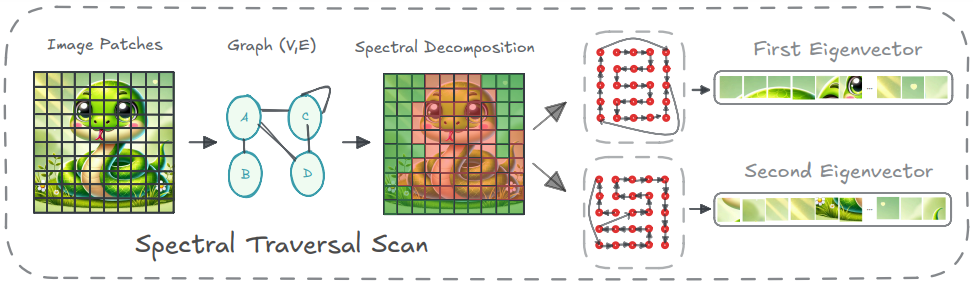

<div align="center">
<h1>[CVPR 2025 🎉] Spectral State Space Model for 

Rotation-Invariant Visual Representation Learning
 </h1>

</div>

Official Implementation of Spectral VMamba:
[](https://arxiv.org/pdf/2503.06369)

## Table of Contents
- [1. Abstract](#1-abstract)
- [2. Overview](#2-overview)
- [3. Main Results](#3-main-results)
  - [**Classification on mini-ImageNet**](#classification-on-mini-imagenet)
- [4. Getting Started](#4-getting-started)
  - [4.1. Installation](#41-installation)
  - [4.2. Model Training and Inference](#42-model-training-and-inference)
- [5. Acknowledgment](#5-acknowledgment)


## 1. Abstract

State Space Models (SSMs) have recently emerged as an alternative to Vision Transformers (ViTs) due to their unique ability of modeling global relationships with linear complexity. SSMs are specifically designed to capture spatially proximate relationships of image patches. However, they fail to identify relationships between conceptually related yet not adjacent patches. This limitation arises from the non-causal nature of image data, which lacks inherent directional relationships. Additionally, current vision-based SSMs are highly sensitive to transformations such as rotation. Their predefined scanning directions depend on the original image orientation, which can cause the model to produce inconsistent patch-processing sequences after rotation.

To address these limitations, we introduce Spectral VMamba, a novel approach that effectively captures the global structure within an image by leveraging spectral information derived from the graph Laplacian of image patches. Through spectral decomposition, our approach encodes patch relationships independently of image orientation, achieving rotation invariance with the aid of our Rotational Feature Normalizer (RFN) module. Our experiments on classification tasks show that Spectral VMamba outperforms the leading SSM models in vision, such as VMamba, while maintaining invariance to rotations and a providing a similar runtime efficiency.

## 2. Overview

<p align="center">
  
  
</p>

## 3. Main Results


### **Classification on mini-ImageNet**
| name | pretrain | resolution |acc@1 | FLOPs | configs/logs/ckpts |
| :---: | :---: | :---: | :---: | :---: | :---: |
| VMamba-T[`s1l8`] | mini-ImageNet | 224x224 | 86.25 | 4.9G |  |
| VMamba-S[`s2l15`] | mini-ImageNet | 224x224 | 86.48 | 8.7G|  |
| VMamba-B[`s2l15`] | mini-ImageNet | 224x224 | 87.17 | 8.7G |  |
| Ours-T[`s1l8`] | mini-ImageNet | 224x224 | 87.86 | 3.9G | [config](classification/configs/vssm/spectral_vmamba_tiny_224.yaml) |
| Ours-S[`s2l15`] | mini-ImageNet | 224x224 | 88.09 | 6.3G | [config](classification/configs/vssm/spectral_vmamba_small_224.yaml) |
| Ours-B[`s2l15`] | mini-ImageNet | 224x224 | 88.17 | 6.3G | [config](classification/configs/vssm/spectral_vmamba_base_224.yaml) |

## 4. Getting Started

### 4.1. Installation

**Step 1: Clone the repository:**

To get started, first clone the project repository and navigate to the project directory.

**Step 2: Environment Setup:**


***Create and activate a new conda environment***

```bash
conda create -n spectral_vmamba
conda activate spectral_vmamba
conda install pytorch==1.13.1 torchvision==0.14.1 torchaudio==0.13.1 pytorch-cuda=11.7 -c pytorch -c nvidia
```

***Install Dependencies***

```bash
pip install -r requirements.txt
cd kernels/selective_scan && pip install .
```
<!-- cd kernels/cross_scan && pip install . -->

### 4.2. Model Training and Inference

**Classification**

To train Our models for classification on ImageNet, use the following commands for different configurations:

```bash
python -m torch.distributed.launch --nnodes=1 --node_rank=0 --nproc_per_node=8 --master_addr="127.0.0.1" --master_port=29501 main.py --cfg </path/to/config> --batch-size 128 --data-path </path/of/dataset> --output /tmp
```

If you only want to test the performance (together with params and flops):

```bash
python -m torch.distributed.launch --nnodes=1 --node_rank=0 --nproc_per_node=1 --master_addr="127.0.0.1" --master_port=29501 main.py --cfg </path/to/config> --batch-size 128 --data-path </path/of/dataset> --output /tmp --pretrained </path/of/checkpoint>
```

## 5. Acknowledgment

This project is based on VMamba ([paper](https://arxiv.org/abs/2401.10166), [code](https://github.com/MzeroMiko/VMamba/tree/main)), thanks for their excellent works.
